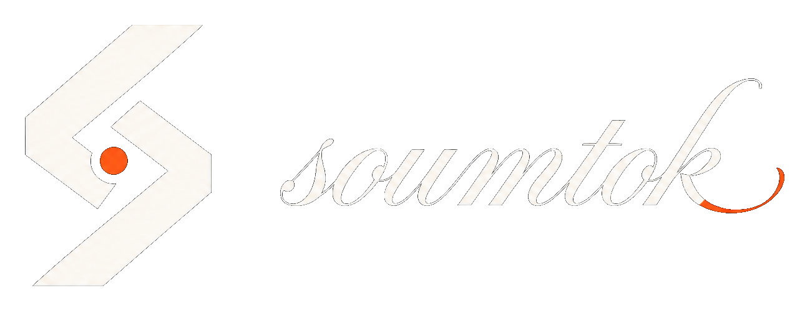

<p align="center">
  <a href="https://soumtok.com">
    
  </a>
</p>

<p align="center">
  <strong>The coding agent for Africa — and anywhere builders ship.</strong><br />
  Studio in the browser. Desktop on your machine. One harness. Every frontier model.
</p>

<p align="center">
  <a href="https://soumtok.com"></a>
  <a href="https://github.com/trysoumtok/Soumtok/blob/main/LICENSE"></a>
  <a href="https://github.com/trysoumtok/Soumtok"></a>
  <a href="https://github.com/trysoumtok/Soumtok/issues"></a>
</p>

---

## Why Soumtok

**Soumtok Agent** is our production-grade AI coding agent — not a chat wrapper. It classifies intent, gates tools, verifies edits, rolls back failures, and scales across long sessions. Built for desks that actually ship: Nairobi first, then everywhere the same loop works.

| | Studio (web) | Desktop (Electron) |
| --- | --- | --- |
| **Agent harness** | Multi-round tools, ask/plan/debug modes | Same harness + local filesystem |
| **Models** | Claude, GPT, Gemini, DeepSeek, Grok, Auto | Your Soumtok account + BYOK keys |
| **Verification** | Typecheck, tests, localhost gates | Checkpoints, rollback, run-state block |
| **Extensions** | Connectors & MCP marketplace | Open VSX + optional code-server host |

Unlike issue-only public repos from some incumbents, **this repository ships the real product**: web app, API server, desktop IDE, shared agent layer, and 200+ tests.

---

## Founder

<table>
<tr>
<td width="120">

</td>
<td>

**Joseph Nyarandi** · Founder & CEO, Soumtok

Joseph started Soumtok so builders can write, test, and ship without leaving the desk — with an agent that recovers from mistakes, not one that hallucinates “done.”

Product · [info@soumtok.com](mailto:info@soumtok.com) · Support · [support@soumtok.com](mailto:support@soumtok.com)

</td>
</tr>
</table>

---

## Features

- **Intent-driven agent** — build, fix, run, chat, image; reclassified from tool evidence each round
- **Verification gates** — TypeScript / tests / localhost before “done”
- **Checkpoint rollback** — failed verify restores files automatically
- **Context compression** — recent tools full fidelity; older rounds summarized
- **Soumtok Bot & IDE Agent** — automation driver vs pair-programming driver
- **Test Hub** — compare models on the same prompt with live preview
- **MCP & plugins** — GitHub, Neon, Slack, Figma, and marketplace connectors

---

## Quick start

### Studio (web + API)

```bash
cp .env.example .env   # configure DATABASE_URL, auth, model keys
npm install
npm run db:migrate
npm run dev            # Vite + Hono API
```

Open the URL printed in the terminal (typically `http://localhost:5173`).

### Desktop IDE

```bash
cp .env.example .env   # SOUMTOK_API=https://soumtok.com
npm install
cd desktop && npm install && cd ..
cd desktop && npm run dev
```

Sign in, open a folder, press **Ctrl+I** for Agent. See [desktop/README.md](desktop/README.md) for packaging and releases.

### Tests

```bash
npm test
npm run test:desktop
```

---

## Repository map

```
src/              Studio UI (React + Vite)
server/           Hono API, auth, billing, agent round-trip
shared/           Agent control layer, tools, model catalog (shared with Desktop)
desktop/          Electron IDE, harness, Monaco, terminal, extensions
docs/             Architecture & Cursor-parity notes
.github/workflows Desktop CI + release pipelines
```

Deep dives: [CURSOR-PARITY-MASTER.md](docs/CURSOR-PARITY-MASTER.md) · [EXTENSION-HOST-ARCHITECTURE.md](desktop/docs/EXTENSION-HOST-ARCHITECTURE.md)

---

## Links

| Resource | URL |
| --- | --- |
| Website | [soumtok.com](https://soumtok.com) |
| GitHub | [github.com/trysoumtok/Soumtok](https://github.com/trysoumtok/Soumtok) |
| Issues & bugs | [GitHub Issues](https://github.com/trysoumtok/Soumtok/issues) |
| Security | [SECURITY.md](SECURITY.md) |

---

## Security

Do **not** commit `.env` or API keys. Use `.env.example` as a template only.

Report vulnerabilities privately: **security@soumtok.com** (see [SECURITY.md](SECURITY.md)).

---

## License & protection

**Proprietary — all rights reserved.** See [LICENSE](LICENSE), [NOTICE](NOTICE), and [TRADEMARK.md](TRADEMARK.md).

You may run and contribute via pull request. You may **not** rebrand, resell, or ship a competing product from this codebase without written permission from Soumtok.

© 2026 Soumtok · Joseph Nyarandi

---

<p align="center">
  <sub>
    <b>Topics:</b> ai · coding-agent · soumtok-agent · ide · electron · llm · mcp · africa · nairobi · typescript · monaco · agent-harness
  </sub>
</p>
